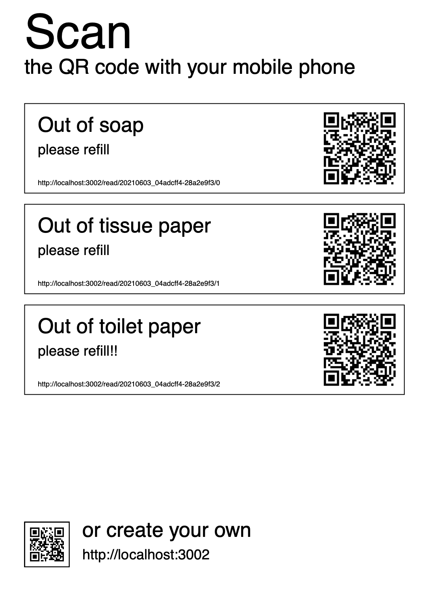
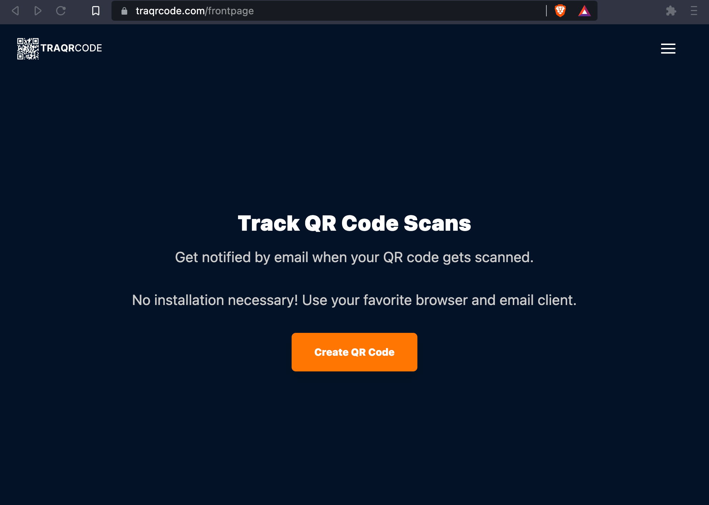

# Monorepo

This repository contains
- web projects (React + NodeJS applications)
- libraries (npm packages)

## Projects

### Traqrcode

Create DIN A4 PDFs showing QR codes.
Receive email notifications when the QR code is scanned.


This is a React / Node application. See [www.traqrcode.com](www.traqrcode.com) for a demo.



## Copyright

```text
Author and copyright
Sebastian F. Walter
sebastian.walter@hekori.com

hekori GmbH
Kastellweg 29
D-69120 Heidelberg
Germany
```

## License

See the LICENSE.md files of libraries and projects.

Everything else is proprietary. All rights reserved.

