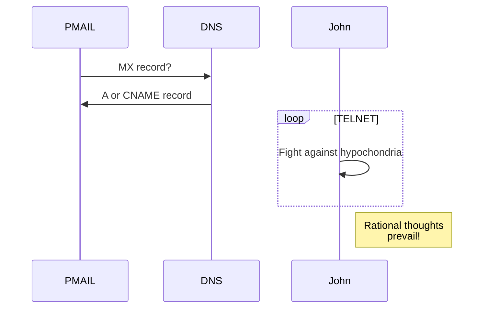

# PROGRAMMATIC MAILER

PMailer is a minimalist, [RFC2821](https://datatracker.ietf.org/doc/html/rfc2821), [RFC5322](https://datatracker.ietf.org/doc/html/rfc5322) compliant email framework for Node.js

Use PMailer to
1. listen for and process incoming emails
2. send emails

to and from your own domain.

PMailer uses DKIM and SPF for reliable email delivery.

## Getting started

```shell
npm install pmailer
```

```typescript
import {pmailer} from 'pmailer'

const server = pmailer({dkim: {domainName: 'xxx', privateKey: 'yyy'}})

// receive and process incoming emails
server.recv(async (mailData:MailData) => {
    console.log(mailData.from)
    console.log(mailData.subject)
    console.log(mailData.text)
})

// send emails
const response = await server.send({
    from: 'test@pmailer.com'
})

if(response.statusCode === '205-OK')

void server.start()
```

# Testing

https://ethereal.email/

```shell
# get MX record of a domain
dig DOMAIN -t MX # copy/paste MXRECORD
telnet MXRECORD 25


```


## DKIM

https://stackoverflow.com/questions/56615230/how-to-calculate-b-parameter-in-dkim-signature

## TLS
https://stackoverflow.com/questions/11046135/how-to-send-email-using-simple-smtp-commands-via-gmail



