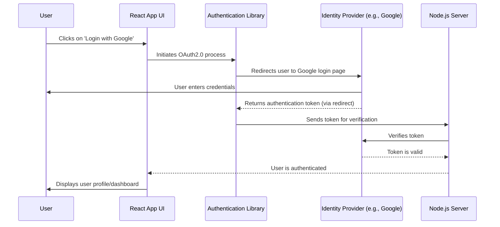

# Authentication

Login Flow Explanation:

- User: Clicks on the 'Login with Google' button in the React App UI.
- React App UI: Initiates the OAuth2.0 process by communicating with the Authentication Library.
- Authentication Library: Redirects the user to the Google login page (or the respective identity provider's login page).
- User: Enters their credentials on the Google login page.
- Google (Identity Provider): Once the user is authenticated, Google returns an authentication token to the Authentication Library via a redirect.
- Authentication Library: Sends the received token to the Node.js Server for verification.
- Node.js Server: Verifies the token with Google to ensure its validity.
- Google: Confirms that the token is valid.
- Node.js Server: Notifies the React App UI that the user is authenticated.
- React App UI: Displays the user's profile or dashboard to the user.
- In this flow, the user is redirected to the identity provider's login page (e.g., Google) rather than being shown a popup.